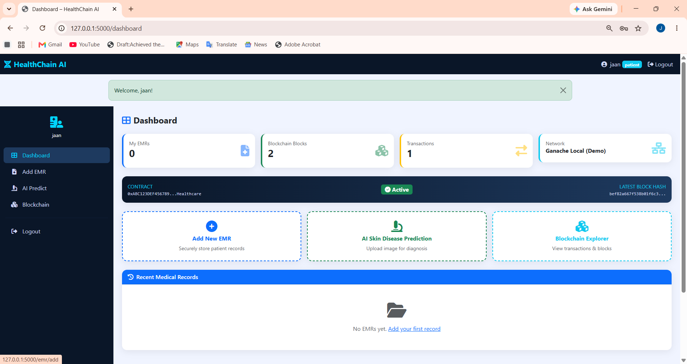
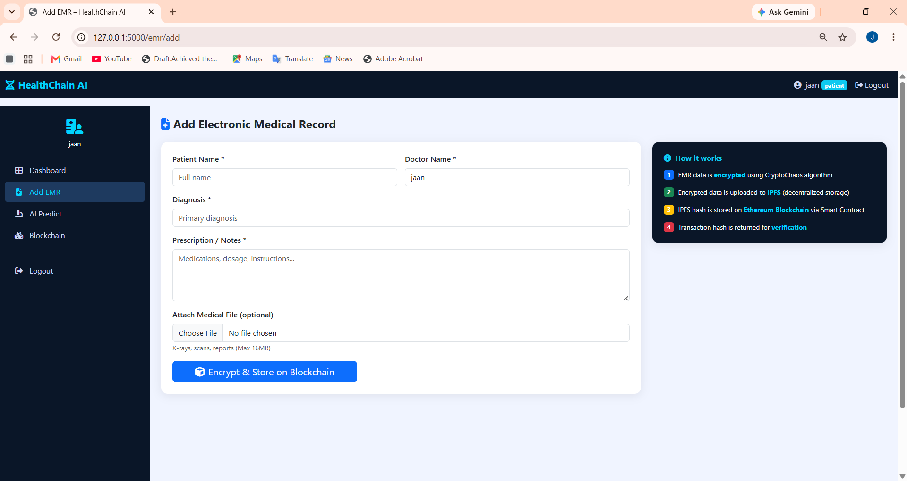
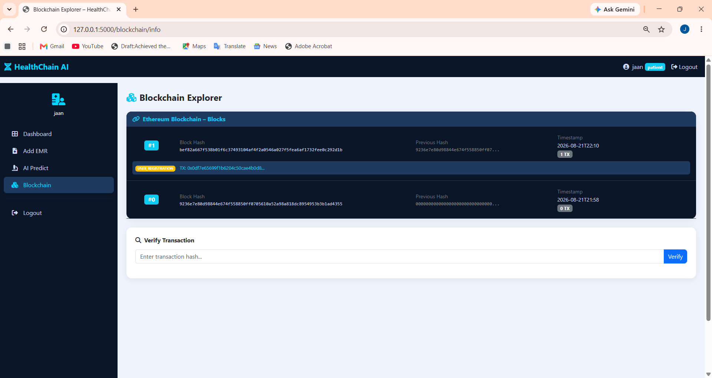

# HealthChain AI
## Intelligent Disease Prediction System using Deep Learning with Secure Blockchain Storage

**Achariya College of Engineering Technology, Pondicherry University – 2025–2026**

**Team:** Jancirani D · Karthiga V · Madhumitha S · Shakira Banu I  
**Guide:** Mrs. Jansi S, M.E., Assistant Professor, Dept. of CSE

---

## Project Structure

```
healthcare_project/
├── app.py                        # Main Flask application
├── requirements.txt              # Python dependencies
├── healthcare.db                 # SQLite database (auto-created)
│
├── blockchain/
│   ├── __init__.py
│   ├── ethereum.py               # Ethereum blockchain manager
│   ├── ipfs_handler.py           # IPFS decentralized storage
│   └── HealthChainAI.sol         # Ethereum Smart Contract (Solidity)
│
├── models/
│   ├── database.py               # SQLite database manager
│   └── efficientnet_model.py     # EfficientNetB0 skin disease predictor
│
├── utils/
│   ├── auth.py                   # User authentication manager
│   └── crypto_chaos.py           # CryptoChaos encryption module
│
├── templates/
│   ├── base.html                 # Base layout with sidebar
│   ├── index.html                # Landing page
│   ├── login.html                # Login page
│   ├── register.html             # Registration page
│   ├── dashboard.html            # Main dashboard
│   ├── add_emr.html              # Add EMR form
│   ├── view_emr.html             # View EMR with blockchain verification
│   ├── predict.html              # AI skin disease prediction
│   ├── blockchain_info.html      # Blockchain explorer
│   └── all_emrs.html             # All records (doctor view)
│
└── static/
    ├── css/                      # Custom stylesheets
    ├── js/                       # Custom JavaScript
    └── uploads/                  # Uploaded skin images
```

---

## Screenshots

### Landing Page


### Login Page


### Dashboard


### EMR


### AI Prediction


### Prediction Result


### Blockchain



## Technology Stack

| Component         | Technology                    |
|-------------------|-------------------------------|
| Backend           | Python 3.10 + Flask           |
| Blockchain        | Ethereum (Ganache / Sepolia)  |
| Smart Contract    | Solidity 0.8.19               |
| Decentralized Storage | IPFS                      |
| Encryption        | CryptoChaos (Logistic Map + AES-256) |
| Deep Learning     | EfficientNetB0 (TensorFlow/Keras) |
| Database          | SQLite (dev) / PostgreSQL (prod) |
| Frontend          | Bootstrap 5 + Font Awesome    |

---

## Quick Start (Demo Mode)

### Step 1: Install minimal dependencies
```bash
pip install flask pillow numpy requests python-dotenv
```

### Step 2: Run the application
```bash
cd healthcare_project
python app.py
```

### Step 3: Open browser
```
http://localhost:5000
```

---

## Full Setup (Production Mode)

### Prerequisites
- Python 3.10+
- Node.js 18+ (for Truffle/Hardhat)
- Ganache (local Ethereum blockchain)
- IPFS Desktop or IPFS CLI

### Step 1: Install all dependencies
```bash
pip install -r requirements.txt
```

### Step 2: Start Ganache (local blockchain)
```bash
# Download Ganache from https://trufflesuite.com/ganache/
# Or use ganache-cli:
npm install -g ganache
ganache --port 7545
```

### Step 3: Deploy Smart Contract
```bash
# Install Truffle
npm install -g truffle

# Compile and deploy
truffle compile
truffle migrate --network development
```

### Step 4: Start IPFS node
```bash
# Install IPFS CLI: https://docs.ipfs.io/install/
ipfs init
ipfs daemon
```

### Step 5: Configure environment
Create `.env` file:
```env
FLASK_SECRET_KEY=your_secret_key_here
ETHEREUM_RPC=http://127.0.0.1:7545
CONTRACT_ADDRESS=0xYourDeployedContractAddress
IPFS_HOST=/ip4/127.0.0.1/tcp/5001
PINATA_API_KEY=your_pinata_key (optional)
PINATA_SECRET=your_pinata_secret (optional)
```

### Step 6: Train EfficientNetB0 Model (optional)
```bash
# Download HAM10000 dataset from Kaggle
# https://www.kaggle.com/datasets/kmader/skin-lesion-analysis-toward-melanoma-detection

python train_model.py
# Model will be saved as models/efficientnetb0_skin.h5
```

### Step 7: Run the application
```bash
python app.py
```

---

## System Modules

### 1. User Authentication Module
- Secure registration with SHA-256 + salt password hashing
- Role-based access control (Doctor / Patient)
- User registration recorded on Ethereum blockchain

### 2. Electronic Medical Record (EMR) Management
- Create, view, and manage patient EMRs
- All records encrypted before storage
- Supports file attachments (X-rays, PDFs, reports)

### 3. CryptoChaos Encryption Module
- Logistic Map chaos theory for key generation
- Keys are highly sensitive to initial conditions
- AES-256-CBC encryption in production mode
- Prevents brute-force attacks

### 4. Blockchain Integration Module (Ethereum)
- Smart Contract: `HealthChainAI.sol`
- Stores IPFS hashes immutably on-chain
- Smart contract events for full audit trail
- PBFT consensus algorithm support

### 5. Decentralized Storage Module (IPFS)
- Content-addressed storage (CID-based)
- Encrypted EMR data stored off-chain
- Hash stored on blockchain for integrity verification
- Supports Pinata Cloud for pinning

### 6. AI Skin Disease Prediction Module (EfficientNetB0)
- Input: 224×224 skin lesion images
- Output: Disease class + confidence score
- Detects: Actinic Keratosis, Atopic Dermatitis, Squamous Cell Carcinoma, Melanoma, etc.
- Predictions recorded on blockchain for audit

---

## API Endpoints

| Endpoint                      | Method | Description                     |
|-------------------------------|--------|---------------------------------|
| `/`                           | GET    | Landing page                    |
| `/register`                   | GET/POST | User registration             |
| `/login`                      | GET/POST | User login                    |
| `/logout`                     | GET    | Logout                          |
| `/dashboard`                  | GET    | Main dashboard                  |
| `/emr/add`                    | GET/POST | Add new EMR                   |
| `/emr/view/<id>`              | GET    | View EMR with blockchain verify |
| `/emr/all`                    | GET    | All EMRs (doctor only)          |
| `/predict`                    | GET/POST | AI skin disease prediction    |
| `/blockchain/info`            | GET    | Blockchain explorer             |
| `/blockchain/verify/<tx>`     | GET    | Verify transaction (JSON)       |
| `/api/emr/<id>`               | GET    | EMR data (JSON)                 |
| `/api/blockchain/stats`       | GET    | Blockchain stats (JSON)         |
| `/api/ipfs/status`            | GET    | IPFS status (JSON)              |

---

## Smart Contract Functions

| Function              | Access  | Description                          |
|-----------------------|---------|--------------------------------------|
| `registerUser()`      | Public  | Register user on blockchain           |
| `storeEMR()`          | Doctor  | Store EMR IPFS hash on-chain          |
| `getEMR()`            | Auth    | Retrieve EMR (logs access)            |
| `verifyEMR()`         | Public  | Verify EMR integrity                  |
| `storePrediction()`   | Auth    | Store AI prediction result            |
| `getPrediction()`     | Public  | Get prediction details                |
| `authorizeDoctor()`   | Owner   | Grant doctor privileges               |
| `invalidateEMR()`     | Owner   | Soft-delete EMR                       |
| `getStats()`          | Public  | Contract statistics                   |

---

## References
1. Alvaro Diaz and Hector Kaschel – "Scalable EHR Management Using Dual Channel Blockchain Hyperledger Fabric" (2023)
2. Kuldeep Vayadande et al. – "Innovative Approaches for Skin Disease Identification in Machine Learning" (2024)
3. Sulay Shrestha and Sagar Panta – "Blockchain-Based Electronic Health Record Management" (2023)
4. Ling-Fang Li et al. – "Deep Learning in Skin Disease Image Recognition" (2020)
5. Kuldeep Vayadande et al. – "Automated Multiclass Skin Disease Diagnosis Using Deep Learning" (2024)
